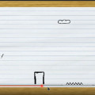
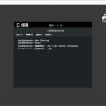
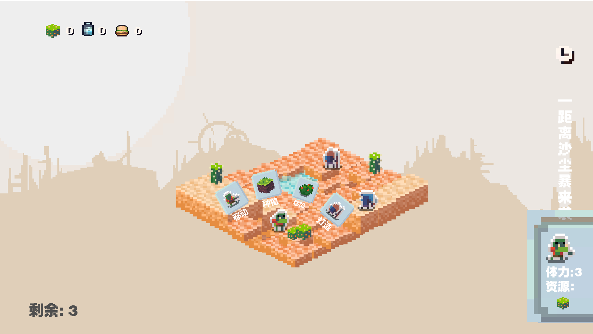
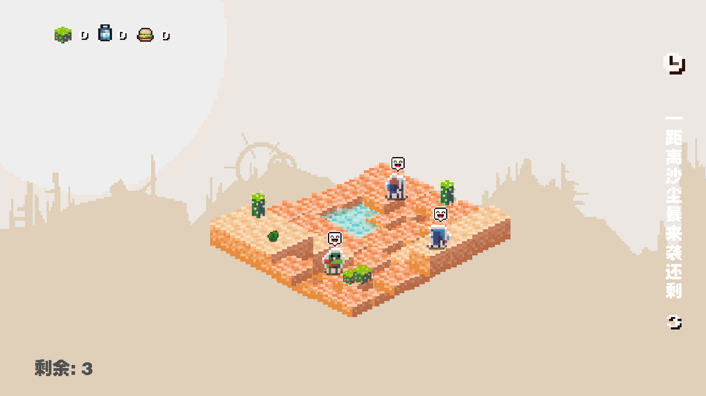
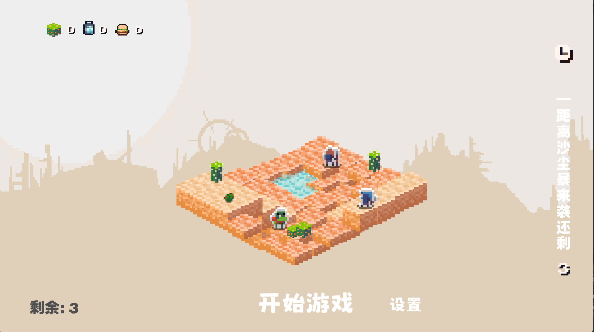
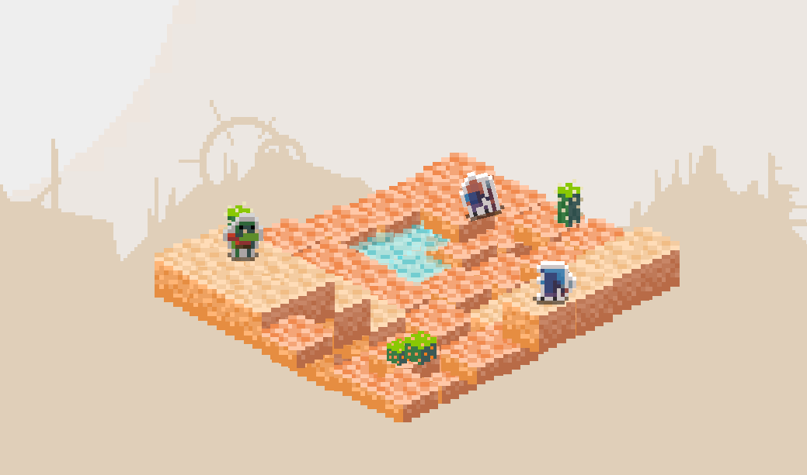

# 做过的一些小DEMO

** 做过的一些小DEMO**

 **纸片冒险**

>  2022的GGJ作品，做的很不完善， 当年的主题：`Kick` 
> 制作时间：2022

??? note "游戏简介"
    通过操作后面的背景来控制小人物的移动，做的很不完善，很

 **开盒**

 
>  2022的GGJ作品，做的很不完善， 当年的主题：`Kick` 
??? note "游戏简介"
    通过操作后面的背景来控制小人物的移动，做的很不完善，很

** 风与砂 **

 
 
>  2022的爱满星空 – 耕耘理想家园 ，该活动是索尼举办的 当年的主题：`耕耘理想家园`  游戏开发时间：7天
??? note "游戏简介"
    通过操作后面的背景来控制小人物的移动，做的很不完善，很

**（未定名） 飞机打怪兽**

 
??? note "游戏简介"
    临时奇异制作的

[赞助](#){ .md-button .md-button--primary }

